# Value Wholesale architecture

Value Wholesale is a fictional membership-warehouse shopping agent built to demonstrate how
Google Agent Development Kit (ADK) and Redis IRIS services can work together in an ecommerce
journey. The application is a FastAPI service with a browser chat UI and supports deployment on
GCP.

The editable Mermaid source is [`docs/architecture.mmd`](docs/architecture.mmd).

## Components

| Layer | Component | Responsibility |
|---|---|---|
| Client | Browser chat UI | Selects one of five demo members and a Gemini model, sends the member/session IDs, and renders the streamed answer and live trace. Changing members starts a fresh session. |
| Application | FastAPI | Exposes the public UI and API, validates requests, coordinates concurrent cache and memory retrieval, and streams newline-delimited JSON events. |
| Agent runtime | Google ADK `Runner` | Runs the Vale agent, manages a session, invokes tools, calls Gemini, and triggers post-turn memory promotion. |
| Models | Gemini 3.1 Flash-Lite / Gemini 3.1 Pro | Flash-Lite is the fast default; Pro is the slower, heavier reasoning option. The selected model chooses one of two prebuilt runners. |
| Commerce data | Redis database + Query Engine | Stores the checked-in catalog, policies, inventory, member, order, and cart data; supports lexical and optional vector product retrieval. |
| Governed context | Redis Context Retriever | Exposes live member, inventory, and order entities through a governed tool surface. FastAPI hydrates and caches the signed-in profile when the member is selected, supplies it to the greeting, and silently reuses it on shopping turns. |
| Semantic routing | RedisVL Semantic Router | Classifies reusable policy, static product-education, shopping-guide, general ecommerce, and out-of-domain prompts using a Redis vector index and the shared local `redis/langcache-embed-v3-small` model. Member-specific, live-data, and sensitive requests are deterministically bypassed first. |
| Semantic cache | Redis LangCache | Serves semantically similar policy, static product-education, and reusable shopping-guide answers without invoking ADK or Gemini. Personalized and live-data requests are not cache eligible. |
| Redis memory | Redis Agent Memory | Receives explicit user and assistant session events and stores/retrieves durable member preference memories. |
| Source systems | Commerce, warehouse, and master-data stores | Persistent systems of record for orders, inventory and fulfillment, products, pricing, and members. |
| Data integration | Redis Data Integration (RDI) | Captures database changes from the source systems and continuously synchronizes the application-ready data model into Redis. |
| Google sessions | Agent Platform Sessions | Persists ADK session events when `VertexAiSessionService` is configured. Sessions are visible under Agent Platform in the GCP console. |
| Google memory | ADK Memory Bank | Retrieves long-term memories and generates new memories from the completed ADK session after a model-generated turn. |

## One chat request

`POST /api/chat/stream` is the main demo path.

1. FastAPI normalizes the member and session IDs. Deterministic guardrails immediately bypass
   caching for member-specific, live-data, or sensitive requests.
2. RedisVL classifies all remaining prompts into policy, static product-education, reusable
   shopping-guide, general ecommerce, or blocked semantic routes. For a short conversational
   follow-up, FastAPI first loads recent Redis Agent Memory session events and supplies that
   context to RedisVL; the resulting context-dependent request is never cache eligible.
3. When RedisVL matches the safe route within its configured cosine-distance threshold,
   FastAPI searches the corresponding versioned LangCache scope. No route or any routing error
   fails closed and bypasses the cache. Independent service reads then run concurrently.
4. Each completed read is emitted to the UI as a trace step with client-observed latency and
   retrieved snippets. Redis receives the user event independently of the ADK session backend.
5. On a LangCache hit, the cached answer is returned immediately. The ADK runner, Gemini,
   Agent Platform Session update, tool calls, and Memory Bank promotion are skipped. Redis
   Agent Memory still receives both the user and cached assistant events.
6. On a cache miss or bypass, the authoritative profile and Redis short- and long-term results
   are added to ADK state before the runner starts.
7. ADK may invoke catalog, policy, cart, memory, or Context Retriever tools. Tool start,
   completion, result summary, and elapsed time are streamed to the UI.
8. ADK stores the conversational turn through its shared session service. The agent's
   post-turn callback asks ADK to generate Memory Bank memories from that session.
9. FastAPI records the assistant event in Redis Agent Memory and stores an eligible reusable
   answer in a versioned LangCache scope. Cacheable answers exclude personalized and live data.

## Model selection and session sharing

The process creates one ADK `Runner` for each approved model:

- `gemini-3.1-flash-lite` — fast/default;
- `gemini-3.1-pro-preview` — heavier reasoning.

Both runners receive the same `session_service` object, `memory_service` object, ADK app name,
member ID, and session ID. Switching models does not create a separate persisted session.
However, both agents use ADK's `include_contents="none"`, so prior Agent Platform events are not
sent to Gemini. Conversational context comes from Redis Agent Memory instead. The authoritative
profile is cached by the application for the selected browser session.

With managed configuration, the shared services are `VertexAiSessionService` and
`VertexAiMemoryBankService`. Without a configured Agent Engine ID, local development falls back
to process-local `InMemorySessionService` and `InMemoryMemoryService`. The two local runners
still share those same in-process instances, but all local session and memory contents disappear
when the process restarts and are not visible in the GCP console.

## Session and long-term memory paths

The application uses the following session and memory paths.

| Concern | Redis path | Google ADK path |
|---|---|---|
| Short-term conversation | FastAPI writes user and assistant events, then sends retrieved recent events to Gemini on the next turn. | The selected runner persists events through `VertexAiSessionService`. A parallel session read is timed, but prior ADK events are excluded from Gemini context. |
| Long-term memory | Explicit preferences are written to Redis Agent Memory; semantic recall is required and sent to Gemini before each generated turn. | The callback promotes the ADK session to Memory Bank. Search is timed in parallel, never sent to Gemini, and never blocks generation. |
| Independence | Redis event writes continue regardless of which ADK session service is selected. | Replacing `InMemorySessionService` with `VertexAiSessionService` changes ADK persistence, not Redis writes. |
| Console visibility | Inspect with Redis Cloud/Redis Insight and the Agent Memory service. | Managed sessions and memories appear under Agent Platform for the configured Agent Engine and region. In-memory fallbacks do not. |

The optional `POST /api/memory/compare` endpoint reports client-observed latency and retrieval
metrics against the checked-in evaluation cases.

## Data and retrieval

The demo's canonical data remains checked into `data/generated` as deterministic JSONL. The
architecture represents three persistent source domains typical of a large warehouse retailer:
commerce and orders, warehouse inventory and fulfillment, and product and membership master
data. These are representative domains; a real enterprise can have many more source systems.

Redis Data Integration (RDI), running on Redis Cloud, consumes change data capture (CDC) streams
from those systems and continuously materializes the relevant operational data into the
low-latency Redis database used by the shopping agent.

LangCache and Redis Agent Memory are shown connected to the Redis database to make their
Redis-backed data plane explicit. They remain distinct managed service capabilities with their
own APIs and lifecycle rather than application code directly reading their records from the
commerce keyspace.

Product discovery uses Redis Query Engine. Lexical retrieval always works; optional semantic
retrieval uses the same local `redis/langcache-embed-v3-small` model as routing, with a versioned
384-dimensional HNSW cosine index. The model is loaded and exercised during page warm-up, then
shared by router and catalog calls for the life of the process. Context Retriever is the required
path for live member, warehouse inventory, and order data in the agent instructions. Redis
fixtures remain available as a local-development fallback.

## Failure behavior

- Missing Redis database configuration uses deterministic local catalog and cart fixtures.
- Missing managed Agent Platform configuration uses in-process ADK session and memory services.
- Managed memory and post-turn promotion fail open so shopping can continue during a workshop.
- Semantic routing errors and non-matches fail closed to ADK; personalized requests always
  bypass LangCache.
- A model timeout produces an error trace instead of an unbounded request.

These fallbacks are for demo resilience, not a production consistency or availability design.

## Code map

| Path | Purpose |
|---|---|
| `valuewholesale_agent/api.py` | HTTP API, concurrent retrieval, cache branching, runners, streaming trace, and memory comparison endpoint. |
| `valuewholesale_agent/agent.py` | Vale's instructions, model-specific agent construction, and Memory Bank promotion callback. |
| `valuewholesale_agent/tools.py` | ADK commerce, Context Retriever, cart, and memory tools. |
| `valuewholesale_agent/services.py` | RedisVL routing, LangCache, Redis Agent Memory, Context Retriever, Redis data, and Vertex Memory Bank adapters. |
| `valuewholesale_agent/config.py` | Environment-driven service, model, project, and region configuration. |
| `valuewholesale_agent/static/` | Browser chat UI and live execution trace. |
| `data/generated/` | Versioned, reproducible demo entities, memories, and retrieval evaluation cases. |
