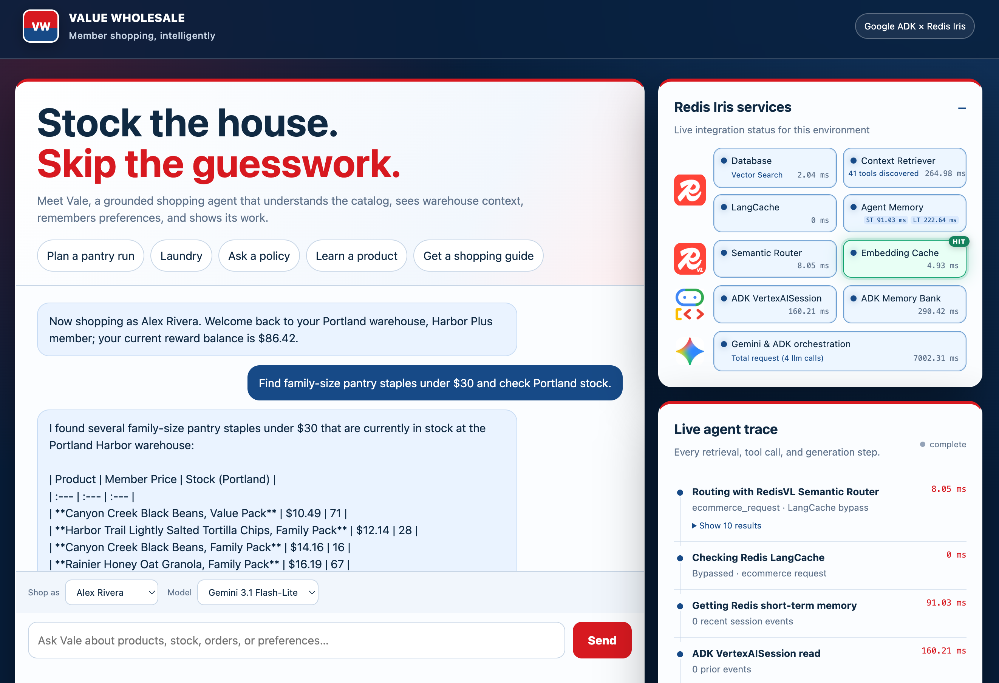

# Value Wholesale Shopping Agent

Value Wholesale is a fictional membership-warehouse ecommerce demo. It recreates the core ideas in the Redis IRIS workshop as one end-to-end shopping journey, implemented with Google Agent Development Kit (ADK) and deployable to Compute Engine or Cloud Run.

The agent can discover products, compare member pricing, check warehouse inventory, inspect recent orders, answer grounded policy questions, build a cart, and remember household shopping preferences.



## Quick links

- [Recommended demo flow](docs/demo.md)
- [Alternative pickup-rescue demo flow](docs/demo2.md)
- [Architecture and request flow](ARCHITECTURE.md)
- [How Temporal would affect the architecture](docs/temporal.md)
- [Reproducible dataset](data/README.md)

## Architecture

See [`ARCHITECTURE.md`](ARCHITECTURE.md) for the complete component map, request flow,
session and long-term memory paths, deployment topology, and a rendered system diagram.

| Capability | Service | Demo role |
|---|---|---|
| Agent runtime | Google ADK + Gemini on Vertex AI | Tool selection and response generation |
| Catalog and policies | Redis database + Query Engine/vector search | Low-latency grounded retrieval |
| Live commerce context | Redis Context Retriever | Governed access to inventory/order entities |
| Cache routing | RedisVL Semantic Router | Safe semantic classification of reusable policy, product-education, and shopping-guide prompts |
| Response cache | Redis LangCache | Scoped cache-aside for policies, static product education, and reusable shopping guides |
| Tool call cache | Redis database | Session-scoped exact read-tool results with a 12-hour TTL; inventory and mutations bypass it |
| Working memory A | Redis Agent Memory | Canonical user prompts and final assistant answers |
| Working memory B | Vertex AI Agent Platform Sessions | The identical canonical prompt/answer transcript in a dedicated ADK session |
| Long-term memory | Redis Agent Memory + Vertex AI ADK Memory Bank | Scoped semantic/episodic preferences and comparison telemetry |
| Hosting | Compute Engine / Cloud Run | Web app and API deployment options |

When an Agent Engine ID is configured, ADK events are stored in Agent Platform Sessions. The chat
offers Gemini 3.1 Flash-Lite for speed and Gemini 3.1 Pro for heavier reasoning.

## Live agent trace

Every shopping request runs semantic routing. A LangCache hit returns before memory retrieval and
agent generation; cache misses and bypasses retrieve the required context and run the agent.
Context Retriever is warmed on startup but is opt-in in the service panel, making it easy to
compare the same journey with and without governed live context. The web UI streams those steps
live and offers demo-member and Gemini-model selectors.

`make setup-memory-bank` idempotently creates or updates the named Vertex Memory Bank, saves
its non-secret resource ID in `.env`, and seeds the same checked-in facts into both managed
long-term memory providers. New conversation turns enqueue the same prompt/answer transcript for
Redis Agent Memory and a dedicated ADK session using the `{session_id}-transcript` backend ID. This
eventually consistent persistence does not delay the answer and is drained during graceful worker
shutdown. The Runner's native session keeps the original ID and continues to feed ADK Memory Bank
generation independently.

## Local start

```bash
cp .env.example .env
uv sync --all-extras
uv run uvicorn valuewholesale_agent.api:app --env-file .env --reload --port 8080
```

`.env.example` is the checked-in configuration template. Each developer copies it to the gitignored `.env` file and adds their own service endpoints, IDs, and credentials there. Never commit a live Redis URL or API key.

Open [http://localhost:8080](http://localhost:8080). Without Redis credentials, the catalog, warehouse, member, and cart tools use deterministic fixtures; managed IRIS capabilities show as unconfigured.

## Configure managed services

Fill the corresponding variables in your local `.env`:

- `REDIS_URL`
- `MCP_AGENT_KEY`
- `LANGCACHE_HOST`, `LANGCACHE_CACHE_ID`, `LANGCACHE_API_KEY`
- `AGENT_MEMORY_BASE_URL`, `AGENT_MEMORY_STORE_ID`, `AGENT_MEMORY_API_KEY`
- `GOOGLE_AGENT_ENGINE_ID`

Then seed the Redis catalog and inventory:

```bash
make setup-iris
```

`make setup-iris` is the repeatable Redis setup command. It regenerates the dataset, seeds the Redis database, creates or updates the `Value Wholesale Shopping` Context Surface through `ctxctl`, imports the Value Wholesale entities, and creates a surface-scoped agent key when `.env` does not already contain one.

Once every managed-service ID is present in `.env` and GCP authentication is active,
`make deploy-all` performs the Redis setup and deploys the Cloud Run service. Production
deployments should use a dedicated least-privilege service identity and Secret Manager.

If Cloud Run public-invoker permissions are unavailable, `make deploy-vm` deploys the UI and API
to the configured Compute Engine region and zone. The command prints the deployment URL when its
health check succeeds.

## Deploy to Compute Engine

The checked-in deployment path is idempotent and does not add project IAM bindings. From a
machine with `gcloud`, `uv`, and access to the target GCP project:

```bash
cp .env.example .env                 # first deployment only; add your service credentials
gcloud auth login
gcloud auth application-default login
export GOOGLE_CLOUD_PROJECT="your-project-id"
export VALUEWHOLESALE_DEPLOY_REGION="your-region"
export VALUEWHOLESALE_VM_ZONE="your-zone"
export VALUEWHOLESALE_VM_REDIS_HOST="your-private-redis-hostname"
make deploy-vm
```

`make deploy-vm` regenerates and seeds the demo data, updates Context Retriever, creates or
reuses the ADK Memory Bank, seeds both long-term memory providers, builds the container, and
updates the configured VM. It prints the deployment URL after the health check passes.

For a code-only redeploy that leaves the managed-service data unchanged:

```bash
./scripts/deploy_vm.sh
```

The VM deployment runs two Uvicorn workers. Other container targets default to one worker and
can override the count with `WEB_CONCURRENCY`.

Verify the deployment using the URL printed by the command:

```bash
curl -fsS "https://your-deployment.example/api/health"
```

The expected response reports both Gemini models and all Redis/Google integrations as `true`.
Stop the VM when the demo is not needed:

```bash
gcloud compute instances stop valuewholesale-demo --zone "$VALUEWHOLESALE_VM_ZONE"
```

The deterministic JSONL dataset lives in [`data/generated`](data/generated) and includes products, warehouses, inventory, members, normalized orders, policies, identical memory seeds, and labeled retrieval-evaluation cases. See [`data/README.md`](data/README.md) for its schema and Redis key model.

The semantic router and product index share the local
`redis/langcache-embed-v3-small` model. Page warm-up loads the 22.6M-parameter model once per
application process before the greeting. The versioned product index uses HNSW,
384-dimensional `FLOAT32` vectors, and cosine distance; category filtering is applied before KNN
search. RedisVL's embedding cache reuses exact text/model vectors for the semantic router and
catalog search with a 24-hour TTL. `make seed` generates product embeddings locally without GCP credentials, while lexical
Redis search remains the fail-open fallback.

## GCP deployment

```bash
gcloud auth application-default login
export GOOGLE_CLOUD_PROJECT="your-project-id"
export VALUEWHOLESALE_DEPLOY_REGION="your-region"
export GOOGLE_MEMORY_LOCATION="your-region"
make check-gcp

uv run python scripts/create_memory_bank.py
export GOOGLE_AGENT_ENGINE_ID=<id printed above>

make deploy
```

The Cloud Run service is public by default and the deploy command prints its HTTPS endpoint URL. Set `PUBLIC_ACCESS=false` only when you intentionally need a private deployment.

The Cloud Run deploy script enables required APIs, reuses the project's existing runtime identity,
creates a labeled Artifact Registry repository, builds the image, and deploys a labeled service in
`us-east4`. It does not add project IAM bindings.

After the Redis services are provisioned, export their values in your shell and run:

```bash
make configure-secrets
```

That script creates or versions labeled Secret Manager secrets without putting secret values in command arguments, then binds them to Cloud Run. Service endpoints and IDs are configured as ordinary environment variables.

## Workshop flow

1. Run product discovery and warehouse inventory using fixtures.
2. Seed Redis and repeat the same grounded queries.
3. Connect Context Retriever and inspect its live tool schemas.
4. Ask semantic paraphrases in the policy, product-education, and shopping-guide examples to
   observe isolated LangCache scopes.
5. Save a shopping preference and watch Redis session memory, both long-term memory systems,
   governed tool calls, and total generation latency appear in the live trace.

## Quality checks

```bash
make lint
make test
```
