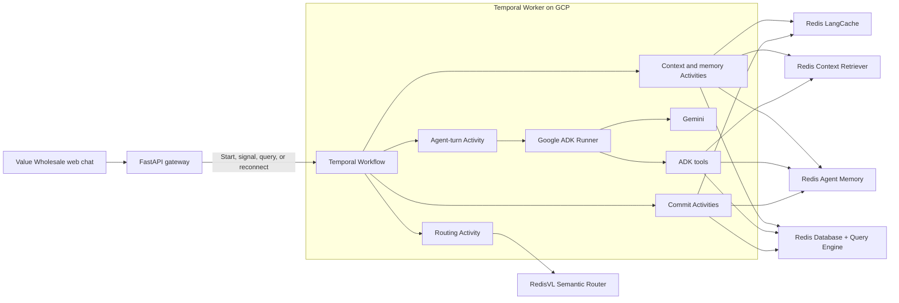

# Redis Iris, Google ADK, and Temporal

Temporal can add durable execution to the Value Wholesale shopping agent without replacing any
of its Redis integrations. Temporal owns workflow progress, retries, timeouts, and recovery;
Google ADK continues to run the agent and Gemini; Redis remains the low-latency data, routing,
cache, governed-context, and agent-memory plane.

## Executive answer

Temporal would add a durable orchestration plane beside the current application; it would not
replace Redis Iris or Google ADK. The most useful initial boundary is long-running, consequential
work such as inventory reservation, approval, checkout, fulfillment, and compensation. Keeping
ordinary read-only shopping questions on the current direct request path avoids adding scheduling
overhead where durable execution provides little value.

The architectural change is therefore additive:

| Today | With Temporal |
|---|---|
| FastAPI owns the lifetime of a request. | FastAPI starts or signals a durable Workflow and can reconnect to it later. |
| A VM/process failure can interrupt an in-flight turn. | A Worker can resume the Workflow from Temporal Event History. |
| Application code coordinates retries and timeouts. | Workflow and Activity policies coordinate retries, timeouts, waiting, and compensation. |
| Redis stores operational state, cache, governed context, and agent memory. | Redis keeps all of those responsibilities; Activity results add workflow execution state in Temporal. |
| ADK runs Gemini and selects tools. | ADK keeps that role, either inside one coarse Activity or through Temporal's ADK integration. |

## Architecture

The ADK Runner remains explicitly visible in this design. Temporal controls when an agent turn
runs and whether it must be retried, while the ADK Runner controls the agent loop, Gemini calls,
and tool selection. Keeping these responsibilities separate prevents Temporal orchestration from
being confused with ADK agent execution or Redis service behavior.

## Two integration options

### Option 1: wrap the existing ADK turn

Run the existing ADK Runner as one coarse-grained Temporal Activity. This is the smallest change
to the current application and is the recommended proof-of-concept boundary. Temporal records the
completed turn result, but an Activity retry reruns the whole agent turn. Every Redis or external
write reachable through an ADK tool must therefore be idempotent, and a repeated Gemini call may
produce a different draft before one result commits.

This option preserves the architecture shown above and lets the customer validate Temporal's
operational value before adopting a deeper agent integration.

### Option 2: use Temporal's Google ADK integration

Temporal's Python SDK includes a Google ADK integration that routes model calls and MCP tools
through Temporal Activities while the agent executes in a replay-safe Workflow environment. This
provides more granular recovery: completed model or tool calls are recorded individually rather
than treating the whole agent turn as one retry unit.

As of July 2026, this integration is marked experimental/pre-release by Temporal. Production
adoption should therefore place it behind an application-owned adapter, pin and qualify the SDK
version, and retain the ability to run the same agent outside Temporal. Redis-side idempotency is
still required for retried writes in either option.

| Decision factor | Coarse ADK-turn Activity | Temporal ADK integration |
|---|---|---|
| Initial code change | Lower | Higher |
| Retry unit | Entire agent turn | Individual model and supported tool calls |
| Existing agent portability | Direct | Preserve through an adapter and local fallback |
| Best fit | Evaluation and durable business workflows | Granular, long-running agent execution |
| Current maturity risk | Core Temporal primitives | Experimental integration surface |

## Component responsibilities

| Component | Responsibility |
|---|---|
| Temporal Workflow | Records durable workflow progress and coordinates retries, timeouts, approvals, recovery, and compensation. |
| Temporal Worker | Executes workflow code and the Activities that call external systems. |
| Google ADK Runner | Runs the Value Wholesale agent, invokes Gemini, selects tools, and emits agent/model/tool events. |
| Gemini | Interprets the request, reasons over supplied context, and generates the response. |
| RedisVL Semantic Router | Classifies requests and decides whether a safe, reusable LangCache scope can be searched. |
| Redis LangCache | Reuses semantically similar responses across separate users, sessions, and workflow executions when the route is cache eligible. |
| Redis Context Retriever | Provides governed access to live member, inventory, order, and policy entities. |
| Redis Agent Memory | Stores conversation events and retrieves durable, member-scoped preferences and facts. |
| Redis Database + Query Engine | Serves operational catalog, inventory, policy, member, order, and cart data. |

Temporal Event History is execution state, not customer memory or an ecommerce database. It
records workflow decisions and completed Activity results so an interrupted workflow can resume
without recomputing completed work. Calls to Redis, Gemini, MCP services, or any other external
system must therefore happen in Activities rather than directly in deterministic workflow code.

Activity inputs and outputs can become part of Event History. The implementation should pass
references and compact results where possible instead of copying entire catalogs, profiles, or
large prompts into the Workflow. Member data in Temporal needs the same retention, encryption,
access-control, and regional-residency review as any other persisted customer data. Redis remains
the source of truth for live and member-facing data; Temporal should retain only what is needed to
resume and audit execution.

## Effect on the Redis integrations

### Redis Database and Query Engine

Redis reads become Activities when they are part of a durable agent workflow. Read retries are
normally safe. Cart changes, inventory reservations, and order mutations must carry a stable
operation ID because an Activity can execute more than once. A Redis key written with `SET NX`,
a transaction, or a Lua function can record that an operation was already applied.

Temporal makes the workflow durable; it does not make external Redis side effects exactly once.

### RedisVL Semantic Router

The current semantic router uses an embedding model and Redis vector search, so it performs
external I/O and must run as an Activity. Its route decision is recorded for that workflow
execution and reused during replay instead of rerunning the embedding and Redis search.

The RedisVL operation happens inside the Activity. Temporal task-queue and scheduling time is
separate from the router's own execution time.

### Redis LangCache

LangCache search is a read Activity, and storing an eligible answer is a write Activity. Cache
writes should use a stable scope and response identity so a retry cannot create unintended
duplicates.

Temporal and LangCache solve different reuse problems:

- Temporal reuses an exact completed Activity result while replaying one workflow execution.
- LangCache reuses semantically similar answers across independent workflow executions.

LangCache therefore remains useful even after Temporal is introduced.

### Redis Context Retriever

Context Retriever discovery and tool execution become Activities. Read-only tools can use normal
retry policies. Tools that change a cart, order, reservation, or member record must accept or
derive a stable operation ID and safely recognize a repeated request.

The governed tool catalog can still be warmed once per application process. Temporal only needs
to record the tool result that affected a particular workflow execution.

### Redis Agent Memory

Session and long-term-memory retrieval become read Activities. Their returned context is fixed
for the current workflow execution, so a replay does not unexpectedly retrieve newer memories
halfway through the same turn.

Appending user and assistant events becomes a write Activity. Each logical event needs a stable
identity or deduplication marker because retries can otherwise append the same event more than
once. Long-term-memory promotion should begin only after the assistant outcome has been
committed, using the same stable turn identity to prevent duplicate promotion.

Redis Agent Memory remains the member-facing conversational and durable memory system. Temporal
history must not be copied wholesale into the model prompt or treated as a replacement memory
store.

## Durable request flow

1. FastAPI starts a workflow for a new turn or signals the workflow associated with an existing
   conversation. It returns a workflow identifier that the browser can use after reconnecting.
2. A routing Activity calls RedisVL and decides whether LangCache is eligible.
3. Context Activities retrieve the required Redis data, governed context, and agent memory. Safe,
   independent reads can run concurrently.
4. A valid LangCache hit can complete the turn without running the ADK Runner or Gemini.
5. On a cache miss or bypass, the agent-turn Activity invokes the ADK Runner. The runner calls
   Gemini and executes the required ADK tools.
6. Commit Activities record the assistant event, persist approved business changes, and store an
   eligible LangCache response.
7. Temporal records completion. If the worker, VM, or browser disappears, another worker can
   resume the workflow from its recorded history.

## Retry and idempotency rules

Temporal Activities retry automatically unless configured otherwise. Every Activity should have
an explicit timeout and a retry policy appropriate to its effect:

| Operation | Suggested behavior |
|---|---|
| Redis read or cache search | Short timeout; retry transient connection and service failures. |
| Semantic routing | Short timeout and bounded retries; preserve the application's explicit fail-open or fail-closed rule. |
| Gemini call | Bounded retries because attempts have cost and may generate different output. A completed result is reused during replay. |
| Memory event append | Retry with a stable turn/event identity and Redis-side deduplication. |
| Cart, inventory, or order mutation | Retry only with a durable operation ID and an idempotent write contract. |
| Memory promotion or cache store | Run after the response commits and deduplicate by turn or response identity. |

## Latency considerations

Temporal introduces workflow-task and Activity scheduling overhead. Making every small Redis
command a separately scheduled Activity could allow orchestration overhead to dominate the
latency being demonstrated. Related, read-only context operations should be grouped into a small
number of logical Activities while keeping consequential writes isolated for independent retry
and idempotency handling.

If the browser disconnects, the workflow should continue unless cancellation is explicitly
requested. On reconnect, the UI can query the workflow's current status and result using the
stable workflow identifier.

## Where Temporal adds the most value

For a simple product or policy question, the current direct asynchronous request path is likely
faster and easier to operate. Temporal becomes valuable when the shopping agent starts a
multi-step process that must survive failures or wait for external input, such as:

1. Build and validate a cart.
2. Reserve inventory at one or more warehouses.
3. Ask the member or an employee to approve a substitution or high-value purchase.
4. Wait for approval without keeping an HTTP request or VM process alive.
5. Submit the order and payment operation.
6. Retry transient failures.
7. Release reservations or compensate prior actions if the order cannot complete.

Redis supplies the current inventory, cart, governed context, cached answers, and member memory
throughout the process. Temporal ensures the business process resumes from the correct point.

## Implementation direction

Temporal's Python SDK includes an experimental Google ADK integration. A production evaluation
should place it behind a small application adapter so the workflow contract is not tightly
coupled to an experimental API.

Introducing Temporal to this repository would require:

- a Temporal service and namespace, either managed or self-hosted;
- a Python Temporal worker deployed on GCP;
- workflow and Activity definitions for routing, retrieval, ADK execution, and commits;
- FastAPI endpoints that start, signal, query, and optionally cancel workflows;
- stable workflow, turn, event, and mutation identifiers;
- Redis-side idempotency for every retried write; and
- operational metrics that separate Temporal overhead from ADK and Redis service latency.

No existing Redis Iris service would be removed.

## References

- [Temporal Workflows](https://docs.temporal.io/workflows)
- [Temporal Activities](https://docs.temporal.io/activities)
- [Temporal retry policies](https://docs.temporal.io/encyclopedia/retry-policies)
- [Temporal Python SDK Google ADK integration](https://github.com/temporalio/sdk-python/tree/main/temporalio/contrib/google_adk_agents)
